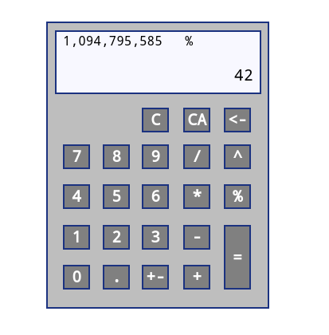

#Funkcionális Specifikáció

## A rendszer céljai

- A rendszer célja, hogy elérhetővé tegyen egy cross-platform számológép alkalmazást.
- Ez a számológép aklakmazás minden felületen operációs rendszer és futtatási környezettől függetlenül egységes legyen mind funkcionalitásban mint stílusban.
- Alapvető matematikai müveleteket el tudja végezni a felhasználó a segítségével.
- Egyszerü és intuitív dizájának köszönhetően bárki, aki már használt számológépet bármiféle segédanyag nélkül tudja kezelni.
- A hordozhatóság, a felhasználók akár telepítés nélkül is egy fájl hordozásával bármilyen java képes rendszeren tudják használni.
## A rendszernek nem céljai

- Complikáltabb matematikai problémák megoldására, mint példáúl teljes egyenletrendszerek vagy többsoros képletek kiértékelésére.

- Tetszőleges tizedesjegyekig való pontosság.
  

## [Jelenlegi helyzet](https://github.com/Chapye/Enigma-Calculator/blob/master/Documents/kov_spec.md)

## [Vágyálom rendszer](https://github.com/Chapye/Enigma-Calculator/blob/master/Documents/kov_spec.md)

## [Követelményrendszer](https://github.com/Chapye/Enigma-Calculator/blob/master/Documents/kov_spec.md)

## Megfeleltetés, hogyan fedik le a használati esetek a követelményeket

- K1 a számológép tudja a 4 alapműveletet (összeadás,kivonás,szorzás,osztás)
  - A grafikus felületen a jól ismert jelöléssel ellátott gombok használatával és a kiértékelés gombol ezen müveletek eredményét az alkalmazás tetején lévő kis kijelző megjeleníti.
- K2 tudjon százalékkal dolgozni
    - A százalékjellel ellátott gomb után százalékot megadva a kijelzőre kerül az előzőleg beütött számnak kért százaléka.
- K3 tudjon négyzetre emelni
  - A négyzetre emelés a már megszokott fizikai számológépes megolsással megyező müveletsorozat eredményezi a grafikus felületen.
- K4 tudjon előjeleket váltani
  - A +/- karakterekkel ellátott gomb megfordítja a számológépbe jelenleg beírt szám előjelét.
- K5 kezelje a tizedestört számokat
  - A tört számokat jelölő gomb lenyámásával egy tizedesvesszőt rakhat a felhasználó a jelenlegi számhoz és aztán a számológép müveletei automatikusan figyelnek az tizees értékekre a számítások során
- K6legyen lehetősége a felhasználónak korrigálni a beírt számokat (backspace funkció)
  - Egy backspace gomb lett elhelyezve a számológép grafikus felületének a jobb felső részén amely a jobról balra nézve legelső számot törtli a kijelzőről.
- K7 legyen lehetőség törölni a beírt számokat egyben (clear funkció)
  - A C betüvel ellátott gomb a számológépen törli a jelenleg beírt számot.
- K8 legyen lehetőség az egész számítási folyamatot törölni (all clear funkció)
  - A CA karakterekkel ellátott gomb törli a jelenlegi számot mint a clear fukció és ezen felül a felbehagyott müveleteket és az ez előtt lenyomott félbehagyott müveleteket is, alaphelyzetbe állítja a számológépet.
- K9 A számológép kijelző osztott kijelzővel rendelkezzen,azaz mutassa a gépelt számokat
  - A számológép kijelzőjén egy kissebb bal felső sarokban lévő extra kijelző lett elhelyezve amely automatikusan erejtésre kerül ha nincs folyamatban valamilyen müvelet de amint egy operátor gombja lenyomódik a fő kijelző betümérete kissebb lesz és bal felül fel lesz tüntetve minden információ a jelenlegi müvelet állapotáról.
- K10 követhető legyen a műveletek sorrendje minden operátor leütése után
  - A bal felső kissebb kijelző az előzőleg lenyomott müveletekhez használt gombokat is mutatja ezen célból.

## Képernyő tervek

A számológép kijelzője tartalmazza a jelenleg beütött értéket és a bal felső rész az előző értéket és a hozzá tartozó operátort, a kiértékeléshez használt "=" -jel el ellátott gomb lenyomása után a bal felső számból a mellette lévő operátór segítségével százalékos eredményét kapjuk vissza annak. Pontosabban a felső szám 42 százalékát.

Az egyszerüség kedvérét több képernyőt az alkalmazás nem tartalmaz, minden szükséges müvelethez tartozó gomb jelen van indításkor és így egy egységes alkalmazást alkot.

## Forgatókönyvek

- Matematikai problémák kiszámítása
  - Először a felhasználó beüt egy számot majd megnyomja azt a gombot ami az általa elvégezni kívánt matematikai müvelethez tartozik. Ezután beüti a probléma második feléhez tartozó számot majd a "="-jelel jelölt kiértékelés gombra kattintva megkapja az eredményt.
  - A felhasználó a számok megadásához a billentyüzeten lévő számokat is használhatja ha nem szeretne kattintani.
- Előjel váltás
  - Amennyiben a felhasználó meg szeretné változtatni az előjelét a jelenleg beütött számnak a "+/-" gomb segítségével ezt megteheti.
- Hiba korrigálása
  - Amennyiben a felhasználó elütött egy vagy több számot a backsapce gombra kattintva bárhány számot törölhet, valamit a "C" vel jelölt (clear) gomb lenyomásával a jelenleg beütött értéket törölheti.
- Számológép alaphelyzetbe állítása
  - A "CA" gomb (clear all) lenyomásával a számológépet a felhasználó alaphelyzetbe állíthatja.